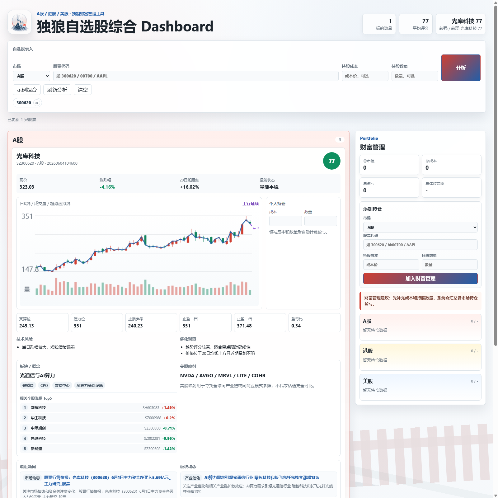

# 自选股综合 Dashboard

## 项目简介

股票智能看板 Dashboard，覆盖 A股、港股、美股数据。用户可以自行添加自选股，对自选股进行技术分析，并通过东方财富、同花顺、雪球、新浪财经等主流财经网站入口，结合市场新闻、公司动态、讨论区情绪面等信息，多角度了解自选股动态。

本项目可作为股票投资者了解持仓和自选股基本情况的基础工具，支持本地部署，也可部署为公网网页。页面提供自选股输入提示、示例组合和分析入口，欢迎试用。

## 界面预览



## 功能

- 输入或粘贴 A股、港股、美股代码。
- 自动识别示例：
  - A股：`300620`、`600519`、`SZ300620`、`SH600519`
  - 港股：`hk00700`、`00700.HK`、`700`
  - 美股：`AAPL`、`TSLA`
- 按 A股、港股、美股分组展示行情。
- 生成趋势评分、技术风险、技术催化。
- 每只股票提供持仓备注，保存在浏览器本地。
- 每只股票提供东方财富、同花顺、雪球、新浪财经入口。

## 本地运行

```powershell
git clone https://github.com/hanszeng626-blip/watchlist-dashboard.git
cd watchlist-dashboard
pip install -r requirements.txt
python app.py
```

浏览器打开：

```text
http://127.0.0.1:8765
```

也可以在 URL 中直接带入自选股：

```text
http://127.0.0.1:8765/?symbols=300620%20hk00700%20AAPL
```

## 公网部署

本项目已经支持云平台部署。部署平台需要能运行 Python Web Service，并提供公网访问域名。

### Render 部署

1. 打开 Render，选择 New Web Service。
2. 连接本仓库：`hanszeng626-blip/watchlist-dashboard`。
3. Build Command 填：

```bash
pip install -r requirements.txt
```

4. Start Command 填：

```bash
python app.py
```

5. Environment Variable 增加：

```text
HOST=0.0.0.0
```

6. 部署完成后，Render 会生成一个公网 URL。

仓库中也提供了 `render.yaml`，支持按 Render Blueprint 方式创建服务。

## 数据来源

- 实时报价：腾讯行情接口。
- A股/港股日线：腾讯 K 线接口。
- 美股日线及兜底日线：Yahoo Chart 公开接口。

评分和风险是技术指标辅助判断，不构成投资建议。
